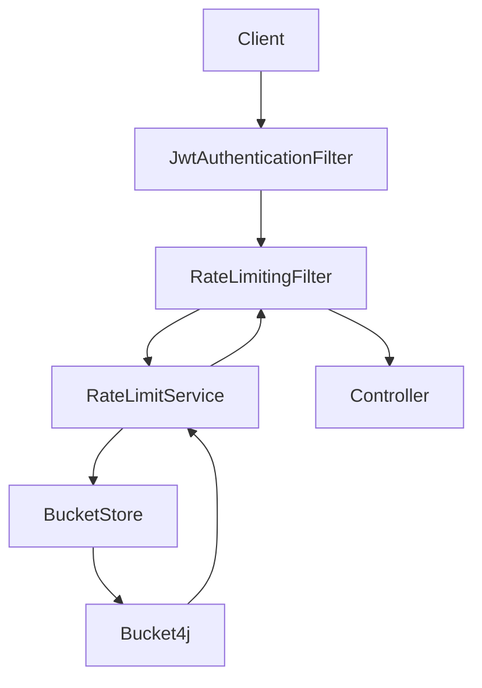
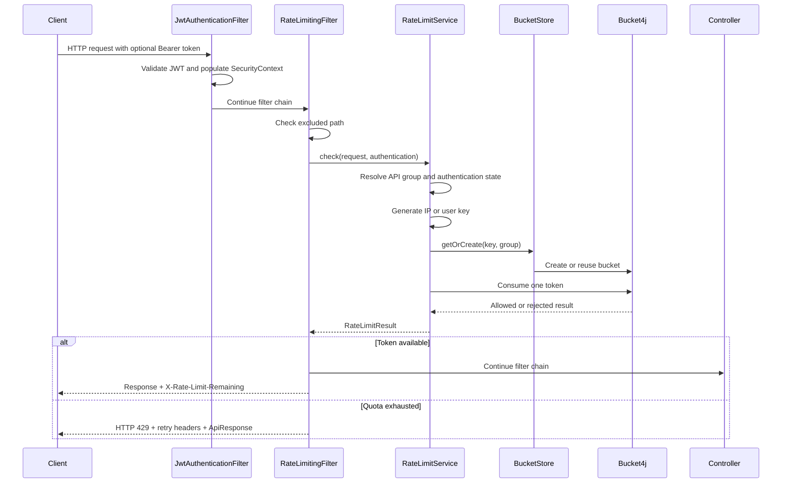
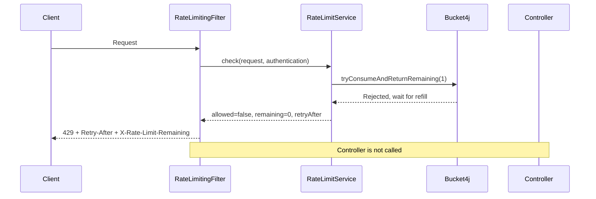

# Rate Limiting

## Table of Contents

- [1. Overview](#1-overview)
- [2. Overall Architecture](#2-overall-architecture)
- [3. API Groups](#3-api-groups)
- [4. Authentication Strategy](#4-authentication-strategy)
- [5. Class Responsibilities](#5-class-responsibilities)
- [6. Request Flow](#6-request-flow)
- [7. Anonymous Request Example](#7-anonymous-request-example)
- [8. Authenticated Request Example](#8-authenticated-request-example)
- [9. HTTP 429 Flow](#9-http-429-flow)
- [10. Bucket Lifecycle](#10-bucket-lifecycle)
- [11. Future Scalability](#11-future-scalability)

## 1. Overview

Rate limiting protects the API from abusive traffic, accidental request storms, and excessive use of sensitive endpoints. Each request consumes one token from a bucket associated with the API group and the request identity.

This implementation uses [Bucket4j](https://bucket4j.com/) because it provides a thread-safe token-bucket implementation, configurable capacity/refill behavior, and a small API that fits naturally into a servlet filter.

Buckets are stored in memory in a single `ConcurrentHashMap<String, BucketEntry>`. This keeps the solution simple and fast for the current deployment model. It does not require Redis, a database, or another distributed cache.

The current limitation is important: this is a **single-instance solution**. Each Spring Boot instance has its own bucket map. If the application is later deployed on multiple instances, a client can receive a separate quota on each instance unless the store is moved to a shared backend or rate limiting is moved to an API gateway.

### Default quotas

All values are configured in `backend/src/main/resources/application.yaml`:

```yaml
rate-limit:
  auth:
    capacity: 30
    refill: 30
    duration: 1m
  tracking:
    capacity: 30
    refill: 30
    duration: 1m
  admin:
    capacity: 300
    refill: 300
    duration: 1m
```

`capacity` is the maximum number of tokens in a bucket. `refill` tokens are added using a greedy refill policy over `duration`. No quota is hard-coded in the Java implementation.

## 2. Overall Architecture

The rate-limit filter is placed after JWT authentication. This order is required because the rate-limit key depends on whether the request is anonymous or authenticated.



The responsibilities are separated as follows:

- `JwtAuthenticationFilter` validates the access token and populates `SecurityContext`.
- `RateLimitingFilter` adapts the servlet request to the rate-limit service and applies the result.
- `RateLimitService` resolves the group, identity key, bucket, and token-consumption result.
- `BucketStore` owns the single in-memory map.
- `Bucket4j` performs token-bucket accounting in a thread-safe manner.

The filter is registered with:

```java
.addFilterBefore(jwtAuthenticationFilter, UsernamePasswordAuthenticationFilter.class)
.addFilterAfter(rateLimitingFilter, JwtAuthenticationFilter.class)
```

## 3. API Groups

`ApiGroup` is the quota namespace. It determines which configured quota is used; it does not by itself determine whether the key is based on IP or user ID.

| API group | Endpoint mapping | Authentication behavior |
|---|---|---|
| `AUTH` | `/api/v1/auth/**` | Login and refresh are normally anonymous and use IP keys. `/me` and logout use user keys when a valid JWT is present. |
| `TRACKING` | `/api/v1/orders/code/**` | Public tracking endpoint; anonymous requests use IP keys. |
| `ADMIN` | `/api/v1/users/**`, `/api/v1/customers/**`, `/api/v1/products/**`, `/api/v1/orders/**` | Protected endpoints; authenticated requests use user keys. |

The tracking pattern is evaluated before the broader `/api/v1/orders/**` pattern, so `/api/v1/orders/code/{orderCode}` is classified as `TRACKING`, not `ADMIN`.

Excluded paths bypass rate limiting completely:

- `/swagger-ui/**`
- `/v3/api-docs/**`
- `/actuator/health`

For an excluded request, the filter does not resolve a group, generate a key, create a bucket, or consume a token.

## 4. Authentication Strategy

The authentication decision is made by `AuthenticationResolver`. A request is authenticated only when all of these conditions are true:

```java
authentication != null
    && authentication.isAuthenticated()
    && !(authentication instanceof AnonymousAuthenticationToken)
```

All other cases are treated as anonymous.

### Anonymous request

```text
Key = {apiGroup}:IP:{clientIp}
```

Example:

```text
TRACKING:IP:203.113.1.1
```

The client IP is resolved in this order:

1. The first address in `X-Forwarded-For`.
2. `X-Real-IP`.
3. `request.getRemoteAddr()` as the final fallback.

### Authenticated request

```text
Key = {apiGroup}:USER:{userId}
```

Example:

```text
ADMIN:USER:550e8400-e29b-41d4-a716-446655440000
```

The authenticated principal name is the UUID from the JWT subject. The JWT filter loads the user and creates the security principal with that UUID as its username.

An authenticated user never consumes the anonymous IP bucket. Therefore, anonymous clients sharing one IP can exhaust their shared IP quota without affecting an authenticated admin using that same IP. Anonymous and authenticated traffic are completely separated by the key prefix and identity segment.

## 5. Class Responsibilities

### `RateLimitingFilter`

- Entry point for rate limiting in the servlet filter chain.
- Skips the excluded endpoint patterns.
- Reads the current `Authentication` from `SecurityContextHolder`.
- Calls `RateLimitService`.
- Adds `X-Rate-Limit-Remaining` for both allowed and rejected requests.
- Adds `Retry-After` and returns HTTP 429 when the quota is exhausted.
- Serializes the standard `ApiResponse` error envelope.

The filter does not generate keys, resolve IPs, create buckets, or contain quota logic.

### `ApiGroupResolver`

- Maps request paths to `AUTH`, `TRACKING`, or `ADMIN`.
- Uses Spring `PathPatternParser` rather than string operations such as `startsWith`, `contains`, or `substring`.
- Returns no group for an unrelated path. Such a request is allowed without creating a rate-limit bucket.

### `ClientIpResolver`

- Resolves the client IP in the documented proxy-header order.
- Handles multiple `X-Forwarded-For` addresses by selecting the first address.
- Is the only component that directly reads `getRemoteAddr()`.

When the application is deployed behind a trusted proxy, proxy header handling must be configured consistently at the infrastructure boundary.

### `AuthenticationResolver`

- Encapsulates the authenticated-versus-anonymous decision.
- Explicitly rejects `AnonymousAuthenticationToken`.
- Prevents a non-null but anonymous authentication object from receiving a user key.

### `RateLimitProperties`

- Maps the `rate-limit` YAML section using `@ConfigurationProperties`.
- Exposes type-safe limits for `AUTH`, `TRACKING`, and `ADMIN`.
- Stores capacity, refill amount, and refill duration.

### `RateLimitService`

- Resolves the API group.
- Chooses the user key or IP key based on authentication state.
- Gets or creates the bucket through `BucketStore`.
- Consumes one token.
- Updates `lastAccessed` for every successful or failed consume attempt.
- Builds an allowed or rejected `RateLimitResult`.

### `BucketFactory`

- Reads the limit for the requested `ApiGroup` from `RateLimitProperties`.
- Creates a Bucket4j bucket with the configured capacity and greedy refill policy.
- Contains no hard-coded quota values.

### `BucketStore`

- Owns the single `ConcurrentHashMap<String, BucketEntry>` shared by IP and user keys.
- Uses `computeIfAbsent` to create a bucket once per key under concurrent access.
- Runs the scheduled idle-entry cleanup.

There are intentionally no separate IP and user stores. The key format provides the separation while keeping storage centralized.

### `BucketEntry`

- Holds one Bucket4j `Bucket`.
- Holds the volatile `lastAccessed` timestamp.
- Updates the timestamp through `touch()` after every consume attempt.

### `RateLimitResult`

- Carries whether the request is allowed.
- Carries remaining tokens for the response header.
- Carries the retry delay in seconds for rejected requests.

## 6. Request Flow

The processing sequence is:

1. The client sends a request.
2. `JwtAuthenticationFilter` checks the bearer token, if present.
3. A valid JWT causes the security context to contain the authenticated user. Missing credentials leave the request anonymous.
4. `RateLimitingFilter` runs after the JWT filter.
5. Excluded paths bypass the rate-limit service.
6. `ApiGroupResolver` identifies the API group from the servlet path.
7. `AuthenticationResolver` determines whether the request is authenticated.
8. `RateLimitService` generates either a user key or an IP key.
9. `BucketStore` gets an existing entry or creates one with `computeIfAbsent`.
10. Bucket4j attempts to consume one token.
11. `BucketEntry.lastAccessed` is updated whether consumption succeeds or fails.
12. An allowed request receives `X-Rate-Limit-Remaining` and continues to the controller.
13. A rejected request receives HTTP 429 and does not continue to the controller.



## 7. Anonymous Request Example

Request:

```http
GET /api/v1/orders/code/TN19830001 HTTP/1.1
Host: api.example.com
X-Forwarded-For: 203.113.1.1, 10.0.0.5
```

There is no valid authenticated principal, so the request is anonymous. `ApiGroupResolver` matches `/api/v1/orders/code/**` as `TRACKING`. `ClientIpResolver` selects the first address from `X-Forwarded-For`.

```text
API group: TRACKING
Client IP: 203.113.1.1
Key:       TRACKING:IP:203.113.1.1
Quota:     30 tokens, refilled at 30 tokens per 1 minute
```

The service obtains or creates this key's bucket and consumes one token. A successful request proceeds to the order tracking controller. Other anonymous clients using the same IP share this same bucket.

## 8. Authenticated Request Example

Request:

```http
GET /api/v1/products HTTP/1.1
Host: api.example.com
Authorization: Bearer <access-token>
```

The access token contains the user UUID as its subject. `JwtAuthenticationFilter` validates it and puts an authenticated principal into the security context. The path matches `ADMIN`.

```text
API group: ADMIN
User ID:   550e8400-e29b-41d4-a716-446655440000
Key:       ADMIN:USER:550e8400-e29b-41d4-a716-446655440000
Quota:     300 tokens, refilled at 300 tokens per 1 minute
```

This request consumes the user's ADMIN bucket. It does not inspect or consume an IP bucket. If anonymous clients from the same network have exhausted `TRACKING:IP:203.113.1.1` or another anonymous bucket, this authenticated request remains independent.

## 9. HTTP 429 Flow

Assume an ADMIN bucket has:

```text
Capacity = 300
Request = #301 before enough refill has occurred
Remaining Tokens = 0
```

When Bucket4j cannot consume a token, `RateLimitService` returns a rejected `RateLimitResult`. The filter returns immediately and does not invoke the controller.

```http
HTTP/1.1 429 Too Many Requests
Content-Type: application/json
Retry-After: 1
X-Rate-Limit-Remaining: 0
```

The exact `Retry-After` value is calculated from Bucket4j's refill wait time and rounded up to seconds.

Response body:

```json
{
  "code": 429,
  "message": "Rate limit exceeded",
  "data": null
}
```

The response uses the project's standard `ApiResponse` envelope.



## 10. Bucket Lifecycle

### Bucket creation

The first request for a key calls:

```java
buckets.computeIfAbsent(
    key,
    ignored -> new BucketEntry(bucketFactory.createBucket(group))
);
```

`BucketFactory` reads the group-specific configuration and creates a Bucket4j token bucket. The new `BucketEntry` starts with `lastAccessed = Instant.now()`.

### Bucket reuse

Subsequent requests with the same key reuse the same `BucketEntry`. Bucket4j maintains the token state, while `RateLimitService` calls `touch()` after every consume attempt:

```java
ConsumptionProbe probe = entry.getBucket().tryConsumeAndReturnRemaining(1);
entry.touch();
```

Both successful and rejected requests update `lastAccessed`. This means an actively abused key is not removed merely because its quota is exhausted.

### Bucket cleanup

`BucketStore.removeIdleBuckets()` is scheduled with a fixed delay of 30 minutes:

```java
@Scheduled(fixedDelay = 30 * 60 * 1000L)
public void removeIdleBuckets() {
    Instant cutoff = Instant.now().minus(Duration.ofHours(24));
    buckets.entrySet().removeIf(entry ->
        entry.getValue().getLastAccessed().isBefore(cutoff));
}
```

Entries with no access for more than 24 hours are deleted. Cleanup bounds the memory retained for old IPs and user IDs. A later request for a deleted key creates a fresh bucket with a full configured capacity.

## 11. Future Scalability

The current design is intended for:

```text
1 Spring Boot instance
1 JVM
1 in-memory bucket map
```

In a multi-instance deployment, the same client may reach different instances and receive separate local buckets. The quota would therefore not be globally consistent.

Possible upgrade paths are:

- **Bucket4j + Redis:** move bucket state to a shared distributed backend while retaining Bucket4j's token-bucket behavior.
- **API Gateway rate limiting:** enforce quotas before traffic reaches application instances, using a gateway or edge service with shared state.

The current separation between group resolution, authentication resolution, key generation, bucket creation, and storage makes such an upgrade localized. The key format and quota semantics can remain stable while `BucketStore` or the enforcement layer is replaced.
